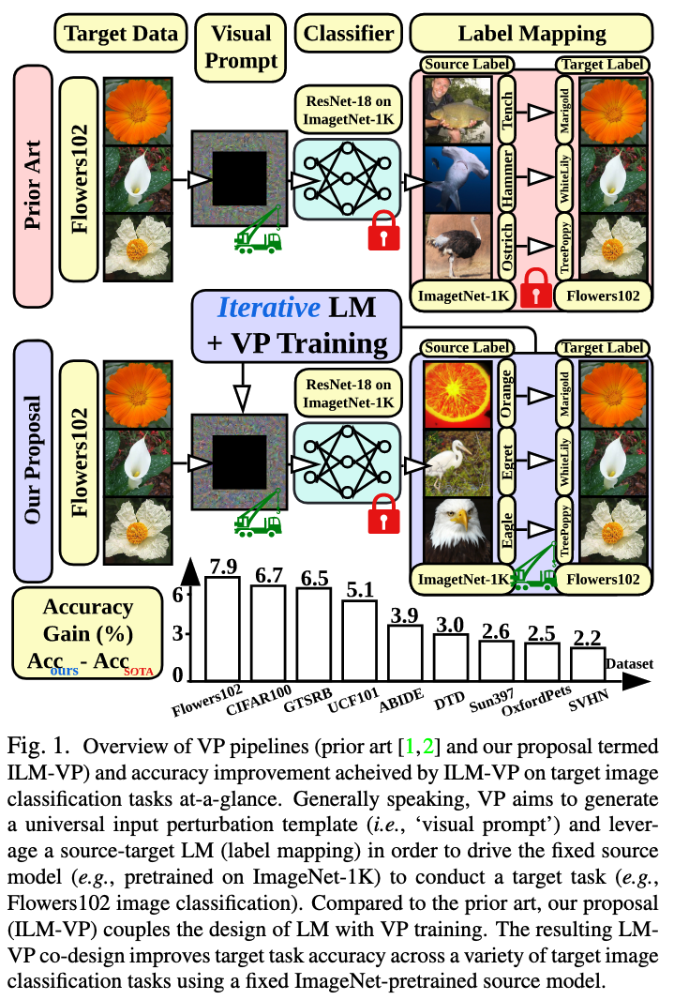

# ILM

Official repository for our work ["Understanding and Improving Visual Prompting: A Label-Mapping Perspective"](https://arxiv.org/abs/2211.11635v1)

In this work, we revisit and advance visual prompting (VP), an input prompting technique for vision tasks. VP can reprogram a fixed, pre-trained source model to accomplish downstream tasks in the target domain by simply incorporating universal prompts (in terms of input perturbation patterns) into downstream data points. Yet, it remains elusive why VP stays effective even given a ruleless label mapping (LM) between the source classes and the target classes. Inspired by the above, we ask: How is LM interrelated with VP? And how to exploit such a relationship to improve its accuracy on target tasks? We peer into the influence of LM on VP and provide an affirmative answer that a better 'quality' of LM (assessed by mapping precision and explanation) can consistently improve the effectiveness of VP. This is in contrast to the prior art where the factor of LM was missing. To optimize LM, we propose a new VP framework, termed ILM-VP (iterative label mapping-based visual prompting), which automatically re-maps the source labels to the target labels and progressively improves the target task accuracy of VP. Further, when using a contrastive language-image pretrained (CLIP) model, we propose to integrate an LM process to assist the text prompt selection of CLIP and to improve the target task accuracy. Extensive experiments demonstrate that our proposal significantly outperforms state-of-the-art VP methods. As highlighted below, we show that when reprogramming an ImageNet-pretrained ResNet-18 to 13 target tasks, our method outperforms baselines by a substantial margin, e.g., 7.9% and 6.7% accuracy improvements in transfer learning to the target Flowers102 and CIFAR100 datasets. Besides, our proposal on CLIP-based VP provides 13.7% and 7.1% accuracy improvements on Flowers102 and DTD respectively.



## What is in this repository?

We provide the training code for our ILM-VP method and the baselines both on ResNets and CLIP.

## Dependencies

Run `pip3 install -r requirement.txt`.

For path configurations, modify `cfg.py` according to your need.

## Datasets

You can find datasets [here](https://drive.google.com/drive/folders/17JpHU_y6Ggc4274TLMmJAE3bsiFtUJDv?usp=share_link).

Put dataset under `data_path` in `cfg.py`. (e.g., data_path/flowers102, data_path/ucf101, ...)

For Flowers102, DTD, UCF101, Food101, EuroSAT, OxfordPets, StanfordCars and SUN397, we use datasets splitted in [CoOp](https://github.com/KaiyangZhou/CoOp). For ABIDE, we use download code in [acerta-abide](https://github.com/lsa-pucrs/acerta-abide). For other datasets we use official ones provided by pytorch.

## Generate Prompts

**VP on ResNet:**

`python experiments/resnet/vp_ilm.py --network resnet18 --dataset cifar10 --mapping-interval K`

$K = 1$：Our ILM-VP method.

$K = 200$：(by default we run 200 epoch) The baseline FLM-VP method.

**TP on CLIP:**

`python experiments/clip/tp_ilm.py --mapping-interval 1 --dataset cifar10`

## Contributor

[Aochuan Chen](https://cse.msu.edu/~chenaoch/)

## Citation
```
@article{chen2022understanding,
  title={Understanding and Improving Visual Prompting: A Label-Mapping Perspective},
  author={Chen, Aochuan and Yao, Yuguang and Chen, Pin-Yu and Zhang, Yihua and Liu, Sijia},
  journal={arXiv preprint arXiv:2211.11635},
  year={2022}
}
```
